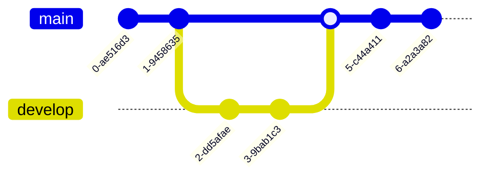

# 加载 flow

```flow
  st=>start: Start
  op=>operation: Your Operation
  cond=>condition: Yes or No?
  e=>end
  st->op->cond
  cond(yes)->e
  cond(no)->op
```

# 加载 sequence

```sequence
Andrew->China: Says Hello
Note right of China: China thinks\nabout it
China-->Andrew: How are you?
Andrew->>China: I am good thanks!
```

# 加载 mermaid

1. 流程图


2. 时序图


3. 类图


4. 状态图


5. 实体关系图


6. 时序图


7. 甘特图


8. 饼图


9. 需求图


10. Gitgraph 图



11. 思维导图


